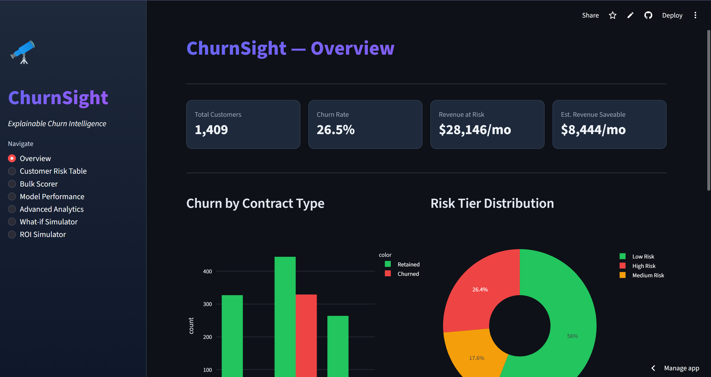
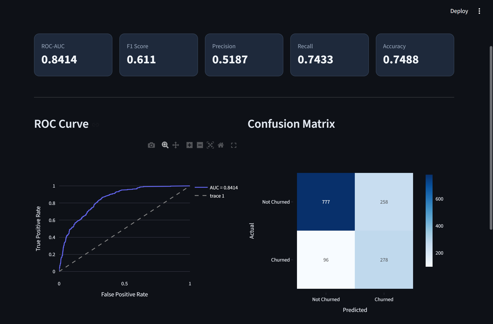
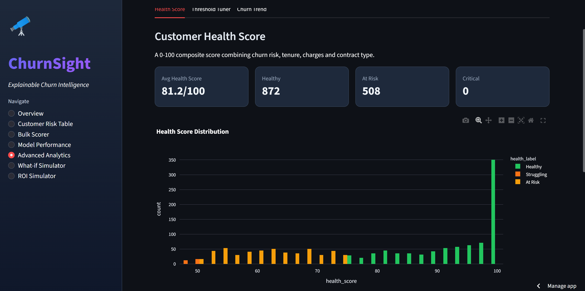

# 🔭 ChurnSight — Explainable Churn Intelligence Dashboard

A production-grade customer churn prediction system with stacking ensemble ML, SHAP explainability, and a 7-page interactive Streamlit dashboard.

## 🚀 Live Demo
👉 [View Live Dashboard](https://churnsight-rtq6ec42ckielfkzgc8q9o.streamlit.app)


## 📸 Screenshots

### Overview


### Customer Risk Table


### Model Performance


### Customer Health Score


### Threshold Tuner


### What-if Simulator


### ROI Simulator


## ✨ Features
- **Stacking Ensemble** — XGBoost + LightGBM → Logistic Regression meta-learner tuned with Optuna
- **SHAP Explainability** — per-customer churn driver analysis with waterfall charts
- **Risk Tier Segmentation** — High / Medium / Low risk classification
- **Retention Recommender** — maps SHAP drivers to actionable business interventions
- **What-if Simulator** — live churn probability gauge updated in real time
- **ROI Simulator** — 12-month retention ROI projection with sensitivity analysis
- **Customer Health Score** — 0-100 composite score per customer
- **Threshold Tuner** — optimize Precision vs Recall for business needs
- **Churn Trend Simulation** — projected customer base with/without retention
- **Bulk CSV Scorer** — score entire customer base with downloadable results

## 📊 Model Performance
| Metric    | Score  |
|-----------|--------|
| ROC-AUC   | ~0.84  |
| F1 Score  | ~0.61  |
| Precision | ~0.52  |
| Recall    | ~0.74  |
| Accuracy  | ~0.75  |

## 🛠️ Tech Stack
- **ML**: XGBoost, LightGBM, Scikit-learn, SHAP, Optuna
- **Data**: Pandas, NumPy, Imbalanced-learn (SMOTE)
- **Dashboard**: Streamlit, Plotly
- **Deployment**: Streamlit Cloud

## 📁 Project Structure
```
churnsight/
├── data/                    # Dataset (not tracked)
├── src/
│   ├── preprocess.py        # Cleaning, encoding, SMOTE
│   ├── train.py             # Stacking ensemble + Optuna tuning
│   ├── explain.py           # SHAP explainability
│   ├── risk_segmentor.py    # Risk tier assignment
│   ├── recommender.py       # Retention action recommender
│   └── analytics.py        # Health score, churn simulation
├── app/
│   └── dashboard.py         # 7-page Streamlit dashboard
├── models/                  # Trained model artifacts
└── requirements.txt
```

## ⚙️ Setup
```bash
# Clone the repo
git clone https://github.com/sanjanamandal1/churnsight.git
cd churnsight

# Create virtual environment
python -m venv venv
venv\Scripts\activate  # Windows
source venv/bin/activate  # Mac/Linux

# Install dependencies
pip install -r requirements.txt

# Add dataset
# Download telco_churn.csv from Kaggle and place in data/
# https://www.kaggle.com/datasets/blastchar/telco-customer-churn

# Train the model
python src/train.py

# Run the dashboard
streamlit run app/dashboard.py
```

## 📸 Dashboard Pages
1. **Overview** — KPIs, churn by contract, risk tier distribution
2. **Customer Risk Table** — filterable table with SHAP deep dive
3. **Bulk Scorer** — CSV upload and download
4. **Model Performance** — ROC curve, confusion matrix
5. **Advanced Analytics** — Health Score, Threshold Tuner, Churn Trend
6. **What-if Simulator** — live churn gauge with recommendations
7. **ROI Simulator** — 12-month ROI projection and sensitivity analysis

## 👩‍💻 Author
**Sanjana Mandal**
- GitHub: [github.com/sanjanamandal1](https://github.com/sanjanamandal1)
- LinkedIn: [linkedin.com/in/sanjana-mandal-956460285](https://www.linkedin.com/in/sanjana-mandal-956460285/)